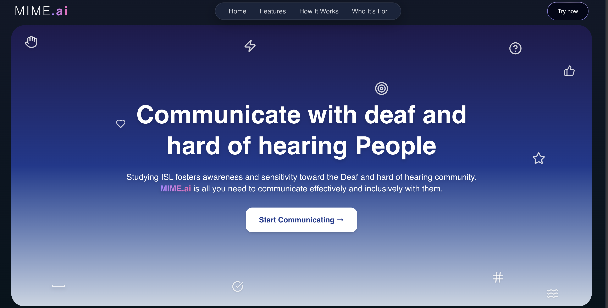
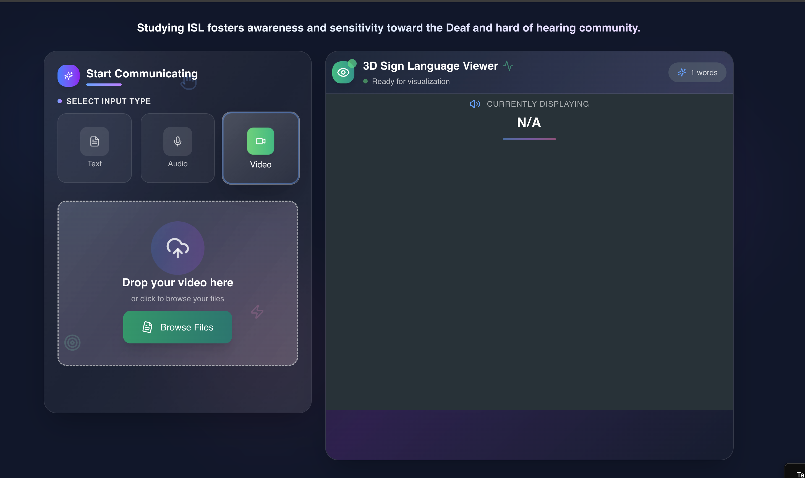
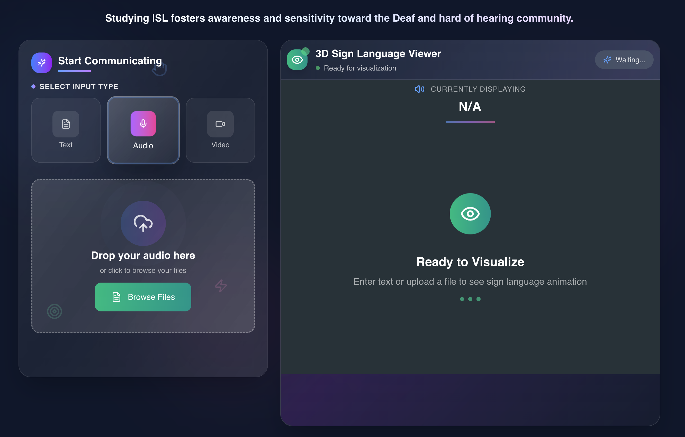
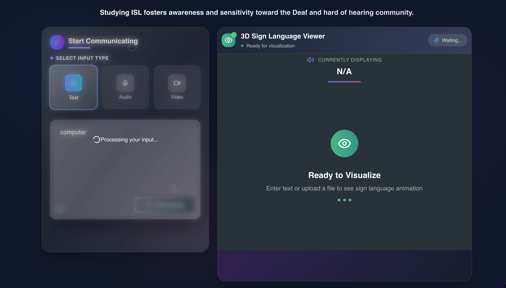
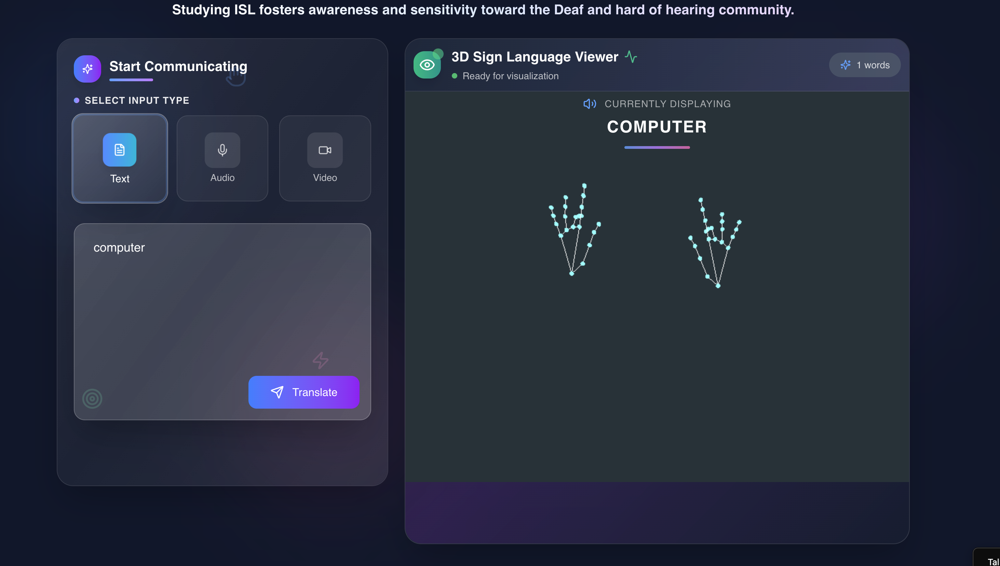

# Mime.ai

_Bridging communication between hearing individuals and the deaf/hard-of-hearing community_











---

## Table of Contents

- [About](#about)
- [Features](#features)
- [Tech Stack](#tech-stack)
- [Project Structure](#project-structure)
- [API Documentation](#api-documentation)
- [Vocabulary Database](#vocabulary-database)
- [Getting Started](#getting-started)
  - [Prerequisites](#prerequisites)
  - [Frontend Setup](#frontend-setup)
  - [Backend Setup](#backend-setup)
- [Environment Variables](#environment-variables)
- [Deployment](#deployment)
- [Contributors](#contributors)
- [License](#license)

---

## About

Mime.ai is a web application designed to bridge the communication gap between hearing individuals and the deaf/hard-of-hearing community. The platform converts text, audio, and video input into American Sign Language (ASL) gloss notation, making it easier for anyone to communicate effectively and inclusively.

Whether you want to convert spoken words from an audio file, transcribe video content, or simply type text to be translated into ASL-compatible gloss, Mime.ai provides a seamless solution.

> **Studying ASL fosters awareness and sensitivity toward the Deaf and hard of hearing community.**

---

## Features

Mime.ai offers multiple input methods to convert your content into ASL gloss:

### 1. Text to ASL Gloss
- Input plain text and receive ASL-compatible gloss notation
- AI-powered synonym mapping finds the best match in the vocabulary database
- Filters out stop words for cleaner output
- Caches synonyms for improved performance

### 2. Audio to ASL Gloss
- Upload audio files (MP3 format)
- Speech-to-text transcription using AssemblyAI
- Converts transcribed text to ASL gloss
- Supports various audio formats via ffmpeg

### 3. Video to ASL Gloss
- Upload video files (MP4, MOV)
- Extracts audio from video using ffmpeg
- Transcribes audio using AssemblyAI
- Converts result to ASL gloss notation

### 4. Language Translation to ASL
- Input text in any language
- Translates to English using Google Translate
- Converts translated text to ASL gloss
- Supports multilingual input

### 5. Speech-to-Text
- Real-time voice transcription
- Client-side speech recognition
- Works directly in the browser
- Perfect for live communication assistance

---

## Tech Stack

### Frontend

| Technology | Purpose |
|------------|---------|
| [Next.js 15](https://nextjs.org/) | React framework for production |
| [React 19](https://react.dev/) | UI library |
| [Tailwind CSS 4](https://tailwindcss.com/) | Styling framework |
| [Framer Motion](https://www.framer.com/motion/) | Animation library |
| [Three.js](https://threejs.org/) | 3D graphics |
| [Lucide React](https://lucide.dev/) | Icon library |
| [Axios](https://axios-http.com/) | HTTP client |
| [TypeScript](https://www.typescriptlang.org/) | Type safety |

### Backend

| Technology | Purpose |
|------------|---------|
| [Django](https://www.djangoproject.com/) | Python web framework |
| [Django REST Framework](https://www.django-rest-framework.org/) | REST API building |
| [Python](https://www.python.org/) | Server-side language |
| [spaCy](https://spacy.io/) | NLP processing |
| [NLTK](https://www.nltk.org/) | Natural language toolkit |
| [ffmpeg](https://ffmpeg.org/) | Audio/video processing |
| [AssemblyAI](https://www.assemblyai.com/) | Speech-to-text API |
| [OpenRouter](https://openrouter.ai/) | AI API for synonym mapping |
| [Google Translate](https://translate.google.com/) | Translation service |

---

## Project Structure

```
Mime_ai/
├── frontend/                      # Next.js frontend application
│   ├── src/
│   │   ├── app/                   # Next.js app directory
│   │   │   ├── page.tsx           # Landing page
│   │   │   ├── layout.tsx         # Root layout
│   │   │   ├── globals.css        # Global styles
│   │   │   ├── upload/            # Upload interface page
│   │   │   │   └── page.tsx
│   │   │   └── speech-to-text/    # Speech-to-text page
│   │   │       └── page.tsx
│   │   ├── components/            # React components
│   │   │   ├── Landing_components/
│   │   │   │   ├── Hero.tsx
│   │   │   │   ├── Features.tsx
│   │   │   │   ├── HowItWorks.tsx
│   │   │   │   ├── ProblemStatement.tsx
│   │   │   │   ├── WhoIsItFor.tsx
│   │   │   │   ├── CTA.tsx
│   │   │   │   ├── Header.tsx
│   │   │   │   └── Footer.tsx
│   │   │   ├── Upload_components/
│   │   │   │   ├── NewUploadInterface.tsx
│   │   │   │   ├── NewInputPanel.tsx
│   │   │   │   └── NewDisplayPanel.tsx
│   │   │   └── Speech-to-text-components/
│   │   │       └── SpeechToTextClient.tsx
│   │   ├── hooks/                 # Custom React hooks
│   │   └── utilities/            # Utility functions
│   ├── package.json
│   ├── tailwind.config.ts
│   ├── tsconfig.json
│   └── next.config.js
│
├── backend/                       # Django backend application
│   ├── Main/                     # Main Django app
│   │   ├── views.py              # API views
│   │   ├── urls.py               # URL routing
│   │   ├── models.py             # Database models
│   │   ├── admin.py              # Django admin config
│   │   ├── apps.py               # App configuration
│   │   ├── tests.py              # Tests
│   │   ├── migrations/           # Database migrations
│   │   ├── vocab/                # Vocabulary data
│   │   │   ├── animation_words.txt   # 1,481 ASL words
│   │   │   └── word_synonym_map.json # Synonym cache
│   │   └── utils/                # Utility modules
│   │       ├── glossifier.py         # Text to gloss conversion
│   │       ├── translator.py         # Language translation
│   │       ├── sign_to_text.py       # Sign language to text
│   │       ├── video_transcriber.py  # Video audio extraction
│   │       └── assemblyai_transcriber.py # Audio transcription
│   ├── SignWave/                 # Legacy/signwave app
│   ├── manage.py                 # Django management script
│   ├── requirements.txt          # Python dependencies
│   ├── setup_model.py            # Model setup script
│   └── render.yaml               # Render deployment config
│
├── README.md                     # This file
└── .gitignore                    # Git ignore rules
```

---

## API Documentation

### Base URL

```
Production: https://mime-ai.onrender.com
Development: http://localhost:8000
```

### Endpoints

#### 1. Process Content

**`POST /api/process/`**

Convert text, audio, or video content to ASL gloss.

| Parameter | Type | Required | Description |
|-----------|------|----------|-------------|
| `category` | string | Yes | One of: `text`, `audio`, `video`, `translate` |
| `text` | string | Yes* | Text input (*required for `text` and `translate`) |
| `file` | file | Yes* | File input (*required for `audio` and `video`) |

**Request Examples:**

```bash
# Text to Gloss
curl -X POST https://mime-ai.onrender.com/api/process/ \
  -F "category=text" \
  -F "text=Hello how are you"

# Audio to Gloss
curl -X POST https://mime-ai.onrender.com/api/process/ \
  -F "category=audio" \
  -F "file=@audio.mp3"

# Video to Gloss
curl -X POST https://mime-ai.onrender.com/api/process/ \
  -F "category=video" \
  -F "file=@video.mp4"

# Translate to English then Gloss
curl -X POST https://mime-ai.onrender.com/api/process/ \
  -F "category=translate" \
  -F "text=Bonjour comment allez-vous"
```

**Response:**

```json
{
  "text": "Original transcribed/translated text",
  "gloss": ["asl", "compatible", "words", "array"]
}
```

For translation category:
```json
{
  "original": "Original non-English text",
  "translated": "English translation",
  "gloss": ["asl", "gloss", "words"]
}
```

#### 2. Health Check

**`GET /api/ping/`**

Check if the API is running.

**Response:**

```json
{
  "message": "pong"
}
```

#### 3. Root Endpoint

**`GET /`**

Server health check.

**Response:**

```json
{
  "status": "ok"
}
```

---

## Vocabulary Database

Mime.ai includes a comprehensive vocabulary database of **1,481 ASL-compatible words** located in `backend/Main/vocab/animation_words.txt`.

The vocabulary includes:
- Common words (a-z)
- Days of the week
- Months of the year
- Numbers (0-100+)
- Countries and nationalities
- Colors
- Animals
- Food items
- Professions
- Emotions
- And much more...

The system uses AI-powered synonym matching to find the closest vocabulary match when input words aren't directly in the database. Results are cached in `backend/Main/vocab/word_synonym_map.json` for improved performance.

---

## Getting Started

Follow these instructions to set up Mime.ai locally on your machine.

### Prerequisites

Before you begin, ensure you have the following installed:

- **Node.js** (v18 or higher)
- **Python** (v3.8 or higher)
- **pip** (Python package manager)
- **ffmpeg** (for audio/video processing)
- **Git**

### Frontend Setup

1. **Navigate to the frontend directory:**

```bash
cd frontend
```

2. **Install dependencies:**

```bash
npm install
```

3. **Create environment variables:**

Create a `.env.local` file in the `frontend` directory:

```bash
# Optional: If connecting to a custom backend
NEXT_PUBLIC_API_URL=http://localhost:8000
```

4. **Start the development server:**

```bash
npm run dev
```

5. **Open your browser:**

Navigate to [http://localhost:3000](http://localhost:3000)

### Backend Setup

1. **Navigate to the backend directory:**

```bash
cd backend
```

2. **Create a virtual environment (recommended):**

```bash
# On macOS/Linux
python -m venv venv
source venv/bin/activate

# On Windows
python -m venv venv
venv\Scripts\activate
```

3. **Install Python dependencies:**

```bash
pip install -r requirements.txt
```

4. **Set up environment variables:**

Create a `.env` file in the `backend` directory:

```bash
# Required API Keys
ASSEMBLYAI_API_KEY=your_assemblyai_api_key
OPENROUTER_API_KEY=your_openrouter_api_key

# Django Secret Key (generate a secure random string)
DJANGO_SECRET_KEY=your_django_secret_key_here

# Debug mode (set to False in production)
DEBUG=True

# Allowed hosts (comma-separated)
ALLOWED_HOSTS=localhost,127.0.0.1
```

5. **Get API Keys:**

   - **AssemblyAI**: Sign up at [assemblyai.com](https://www.assemblyai.com/)
   - **OpenRouter**: Sign up at [openrouter.ai](https://openrouter.ai/)

6. **Run database migrations:**

```bash
python manage.py migrate
```

7. **Start the development server:**

```bash
python manage.py runserver
```

8. **Verify the API:**

Open [http://localhost:8000](http://localhost:8000) in your browser - you should see:
```json
{"status": "ok"}
```

---

## Environment Variables

| Variable | Required | Description |
|----------|----------|-------------|
| `ASSEMBLYAI_API_KEY` | Yes | API key for AssemblyAI speech-to-text service |
| `OPENROUTER_API_KEY` | Yes | API key for OpenRouter AI synonym mapping |
| `DJANGO_SECRET_KEY` | Yes | Django secret key for security |
| `DEBUG` | No | Set to `True` for development, `False` for production |
| `ALLOWED_HOSTS` | No | Comma-separated list of allowed hosts |

---

## Deployment

### Frontend (Vercel)

1. Push your code to a GitHub repository
2. Go to [Vercel](https://vercel.com/)
3. Import your repository
4. Configure the build settings:
   - Build Command: `npm run build`
   - Output Directory: `.next`
5. Add environment variables in Vercel dashboard
6. Deploy

### Backend (Render)

1. Push your code to a GitHub repository
2. Go to [Render](https://render.com/)
3. Create a new Web Service
4. Connect your GitHub repository
5. Configure:
   - Build Command: `pip install -r requirements.txt`
   - Start Command: `gunicorn SignWave.wsgi:application`
6. Add environment variables
7. Deploy

---

## Live Demos

- **Frontend**: [https://mime-ai-7vxu.vercel.app/](https://mime-ai-7vxu.vercel.app/)
- **Backend**: [https://mime-ai.onrender.com/](https://mime-ai.onrender.com/)

> **Note**: The backend is deployed on Render's free tier and falls asleep after 15 minutes of inactivity. The first request after sleep may take 30-60 seconds to wake up. Please be patient!

---

## Contributors

Mime.ai was built with love by:

- **Kartik** ([@kartik-m39](https://github.com/kartik-m39))
- **Madhav** ([@madhavv-xd](https://github.com/madhavv-xd))
- **Rachit** ([@rachitgoyal3313](https://github.com/rachitgoyal3313))
- **Divyansh** ([@Divy13ansh](https://github.com/Divy13ansh))

---

## License

This project is licensed under the MIT License - see the LICENSE file for details.

---

## Acknowledgments

- [AssemblyAI](https://www.assemblyai.com/) for providing excellent speech-to-text services
- [OpenRouter](https://openrouter.ai/) for AI-powered synonym mapping
- The ASL community for their continued support and inspiration
- All open-source projects that made this possible
