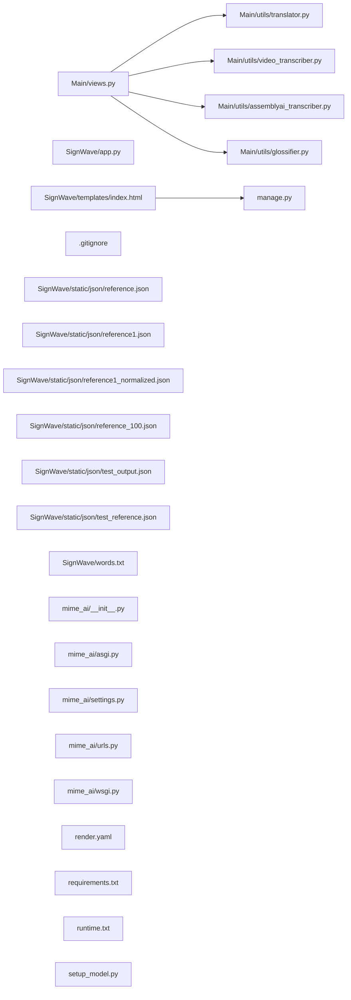

## ARCHITECTURE

A software project composed of the following subsystems:

- **SignWave/**: Primary subsystem containing 24 files
- **Main/**: Primary subsystem containing 15 files
- **mime_ai/**: Primary subsystem containing 5 files
- **Root**: Contains scripts and execution points

## ENTRY_POINTS

### `manage.py`

```python
#!/usr/bin/env python
"""Django's command-line utility for administrative tasks."""
import os
import sys


def main():
    """Run administrative tasks."""
    os.environ.setdefault('DJANGO_SETTINGS_MODULE', 'mime_ai.settings')
    try:
        from django.core.management import execute_from_command_line
    except ImportError as exc:
        raise ImportError(
            "Couldn't import Django. Are you sure it's installed and "
            "available on your PYTHONPATH environment variable? Did you "
            "forget to activate a virtual environment?"
        ) from exc
    execute_from_command_line(sys.argv)


if __name__ == '__main__':
    main()

```

## SYMBOL_INDEX

**`manage.py`**
- `main()`

**`Main/utils/assemblyai_transcriber.py`**
- `upload_audio()`
- `transcribe_audio()`

**`Main/utils/glossifier.py`**
- `save_cache()`
- `get_synonym_in_vocab_spacy()`
- `normalize_and_glossify()`

**`Main/utils/translator.py`**
- `translate_to_english()`

**`Main/utils/video_transcriber.py`**
- `extract_audio_from_video()`
- `upload_audio_to_assemblyai()`
- `transcribe_audio_assemblyai()`
- `video_to_text()`

**`Main/views.py`**
- class `UnifiedGlossView`
  - `post()`
- class `Ping`
  - `get()`

**`SignWave/app.py`**
- `english_to_gloss()`
- `modify_words()`
- `index()`
- `upload_file()`

## IMPORTANT_CALL_PATHS

app.english_to_gloss()
## CORE_MODULES

### `Main/utils/assemblyai_transcriber.py`

**Purpose:** Implements assemblyai transcriber.

**Functions:**
- `def transcribe_audio(file_path)`
- `def upload_audio(file_path)`

## Constants
ASSEMBLYAI_API_KEY = os.getenv("ASSEMBLYAI_API_KEY")

### `Main/utils/glossifier.py`

**Purpose:** Implements glossifier.

**Functions:**
- `def get_synonym_in_vocab_spacy(word)`
- `def normalize_and_glossify(text)`
- `def save_cache()`

## Constants
CACHE_FILE = 'Main/vocab/word_synonym_map.json'

### `Main/utils/translator.py`

**Purpose:** Implements translator.

**Functions:**
- `def translate_to_english(text)`

### `Main/utils/video_transcriber.py`

**Purpose:** Implements video transcriber.

**Functions:**
- `def extract_audio_from_video(video_path, audio_output_path)`
- `def transcribe_audio_assemblyai(audio_url)`
- `def upload_audio_to_assemblyai(audio_path)`
- `def video_to_text(video_path)`

## Constants
ASSEMBLYAI_API_KEY = os.getenv("ASSEMBLYAI_API_KEY")

### `Main/views.py`

**Purpose:** Implements views.
**Depends on:** `utils.assemblyai_transcriber`, `utils.glossifier`, `utils.translator`, `utils.video_transcriber`

**Types:**
- `Ping` (bases: `APIView`) methods: `get`
- `UnifiedGlossView` (bases: `APIView`) methods: `post`

### `README.md`

**Purpose:** Implements README.

## SUPPORTING_MODULES

### `SignWave/app.py`

```python
def english_to_gloss(text)

def modify_words(text)

def index()

def upload_file()

```

### `SignWave/templates/index.html`

*66 lines, 0 imports*

### `.gitignore`

*36 lines, 0 imports*

### `SignWave/words.txt`

*1482 lines, 0 imports*

### `mime_ai/__init__.py`

*0 lines, 0 imports*

### `mime_ai/asgi.py`

> 
ASGI config for mime_ai project.

It exposes the ASGI callable as a module-level variable named ``application``.

For more information on this file, see
https://docs.djangoproject.com/en/5.2/howto/deployment/asgi/


*17 lines, 2 imports*

### `mime_ai/settings.py`

*129 lines, 3 imports*

### `mime_ai/urls.py`

> 
URL configuration for mime_ai project.

The `urlpatterns` list routes URLs to views. For more information please see:
    https://docs.djangoproject.com/en/5.2/topics/http/urls/
Examples:
Function views
    1. Add an import:  from my_app import views
    2. Add a URL to urlpatterns:  path('', views.home, name='home')
Class-based views
    1. Add an import:  from other_app.views import Home
    2. Add a URL to urlpatterns:  path('', Home.as_view(), name='home')
Including another URLconf
    1. Import the include() function: from django.urls import include, path
    2. Add a URL to urlpatterns:  path('blog/', include('blog.urls'))


*24 lines, 2 imports*

### `mime_ai/wsgi.py`

> 
WSGI config for mime_ai project.

It exposes the WSGI callable as a module-level variable named ``application``.

For more information on this file, see
https://docs.djangoproject.com/en/5.2/howto/deployment/wsgi/


*17 lines, 2 imports*

### `runtime.txt`

*1 lines, 0 imports*

### `setup_model.py`

*2 lines, 0 imports*

## DEPENDENCY_GRAPH



## RANKED_FILES

| File | Score | Tier | Tokens |
|------|-------|------|--------|
| `manage.py` | 0.600 | full source | 142 |
| `Main/utils/assemblyai_transcriber.py` | 0.500 | structured summary | 64 |
| `Main/utils/glossifier.py` | 0.500 | structured summary | 66 |
| `Main/utils/translator.py` | 0.500 | structured summary | 27 |
| `Main/utils/video_transcriber.py` | 0.500 | structured summary | 91 |
| `Main/views.py` | 0.500 | structured summary | 81 |
| `README.md` | 0.400 | structured summary | 11 |
| `SignWave/app.py` | 0.200 | signatures | 31 |
| `SignWave/templates/index.html` | 0.150 | signatures | 16 |
| `.gitignore` | 0.100 | signatures | 13 |
| `SignWave/static/json/reference.json` | 0.100 | one-liner | 14 |
| `SignWave/static/json/reference1.json` | 0.100 | one-liner | 17 |
| `SignWave/static/json/reference1_normalized.json` | 0.100 | one-liner | 18 |
| `SignWave/static/json/reference_100.json` | 0.100 | one-liner | 17 |
| `SignWave/static/json/test_output.json` | 0.100 | one-liner | 16 |
| `SignWave/static/json/test_reference.json` | 0.100 | one-liner | 15 |
| `SignWave/words.txt` | 0.100 | signatures | 17 |
| `mime_ai/__init__.py` | 0.100 | signatures | 17 |
| `mime_ai/asgi.py` | 0.100 | signatures | 68 |
| `mime_ai/settings.py` | 0.100 | signatures | 15 |
| `mime_ai/urls.py` | 0.100 | signatures | 181 |
| `mime_ai/wsgi.py` | 0.100 | signatures | 69 |
| `render.yaml` | 0.100 | one-liner | 10 |
| `requirements.txt` | 0.100 | one-liner | 10 |
| `runtime.txt` | 0.100 | signatures | 13 |
| `setup_model.py` | 0.100 | signatures | 14 |
| `Main/__init__.py` | 0.100 | one-liner | 13 |
| `Main/admin.py` | 0.100 | one-liner | 15 |
| `Main/apps.py` | 0.100 | one-liner | 19 |
| `Main/migrations/__init__.py` | 0.100 | one-liner | 15 |
| `Main/models.py` | 0.100 | one-liner | 15 |
| `Main/tests.py` | 0.100 | one-liner | 15 |
| `Main/urls.py` | 0.100 | one-liner | 20 |
| `Main/utils/sign_to_text.py` | 0.100 | one-liner | 14 |
| `Main/vocab/animation_words.txt` | 0.100 | one-liner | 16 |
| `Main/vocab/word_synonym_map.json` | 0.100 | one-liner | 17 |
| `SignWave/ASLCoordinateDictionary.py` | 0.100 | one-liner | 20 |
| `SignWave/convert_to_csv.py` | 0.100 | one-liner | 19 |
| `SignWave/debug.py` | 0.100 | one-liner | 16 |
| `SignWave/extract.py` | 0.100 | one-liner | 17 |

## PERIPHERY

- `SignWave/static/json/reference.json` — 1 lines
- `SignWave/static/json/reference1.json` — 3470948 lines
- `SignWave/static/json/reference1_normalized.json` — 3470948 lines
- `SignWave/static/json/reference_100.json` — 174341 lines
- `SignWave/static/json/test_output.json` — 45411 lines
- `SignWave/static/json/test_reference.json` — 0 lines
- `render.yaml` — 21 lines
- `requirements.txt` — 102 lines
- `Main/__init__.py` — 0 lines
- `Main/admin.py` — 1 imports, 4 lines
- `Main/apps.py` — 1 class, 1 imports, 7 lines
- `Main/migrations/__init__.py` — 0 lines
- `Main/models.py` — 1 imports, 4 lines
- `Main/tests.py` — 1 imports, 4 lines
- `Main/urls.py` — 1 function, 3 imports, 14 lines
- `Main/utils/sign_to_text.py` — 24 lines
- `Main/vocab/animation_words.txt` — 1482 lines
- `Main/vocab/word_synonym_map.json` — 5 lines
- `SignWave/ASLCoordinateDictionary.py` — 5 imports, 159 lines
- `SignWave/convert_to_csv.py` — 3 imports, 37 lines
- `SignWave/debug.py` — 1 imports, 18 lines
- `SignWave/extract.py` — 1 imports, 19 lines
- `SignWave/majdoor.py` — 4 imports, 105 lines
- `SignWave/normalize_frames.py` — 1 function, 1 imports, 28 lines
- `SignWave/reference1_flat.csv` — 422123 lines
- `SignWave/reference1_normalized.csv` — 422123 lines
- `SignWave/requirements.txt` — 17 lines
- `SignWave/static/css/styles.css` — 151 lines
- `SignWave/static/img/devpost-icon.svg` — 17 lines
- `SignWave/static/img/github-icon.svg` — 1 lines
- `SignWave/static/js/main.js` — 1 imports, 147 lines
- `SignWave/static/js/postHandler.js` — 22 lines
- `SignWave/static/json/min_reference.json` — 18259 lines

