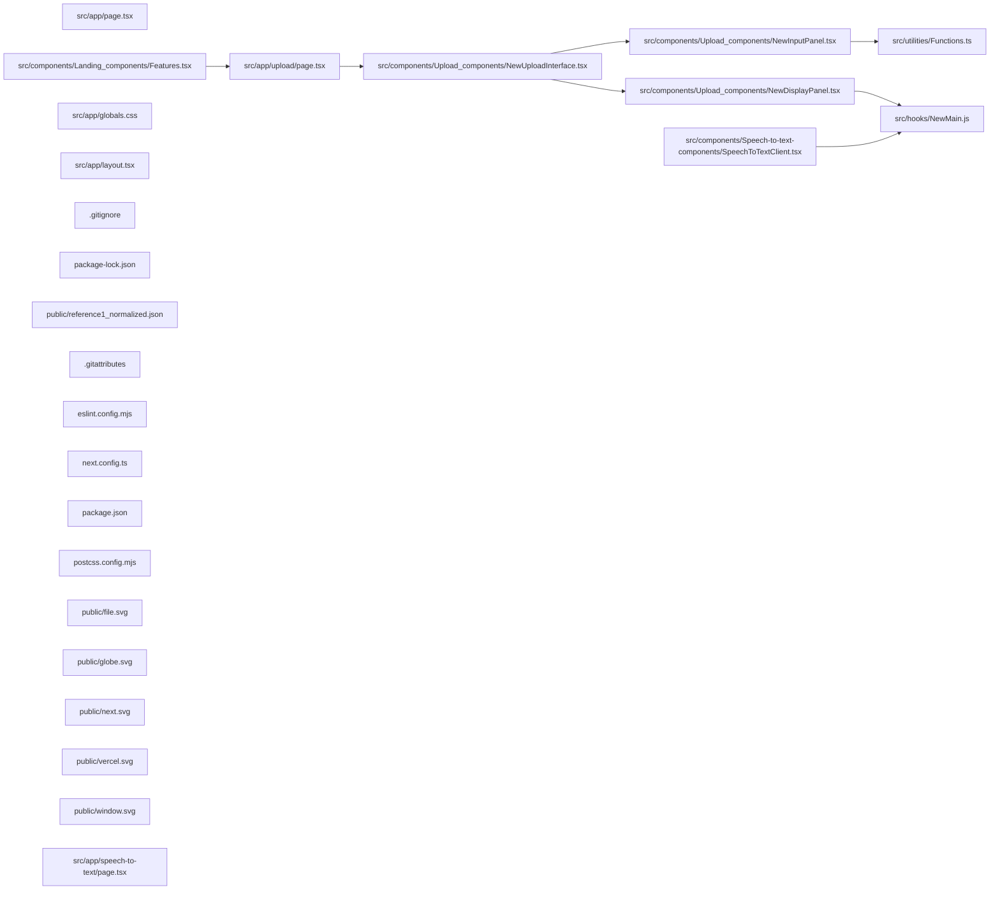

## ARCHITECTURE

A software project composed of the following subsystems:

- **src/**: Primary subsystem containing 19 files
- **public/**: Primary subsystem containing 6 files
- **Root**: Contains scripts and execution points

## ENTRY_POINTS

*No entry points identified within budget.*

## SYMBOL_INDEX

**`src/hooks/NewMain.js`**
- `setSpeed()`
- `updateWordList()`
- `toVec()`
- `NewThree()`

**`src/app/page.tsx`**
- `Home()`

**`src/components/Landing_components/Features.tsx`**
- `Features()`

**`src/components/Upload_components/NewDisplayPanel.tsx`**
- `NewDisplayPanel()`

**`src/app/upload/page.tsx`**
- `Upload()`

**`src/components/Upload_components/NewUploadInterface.tsx`**
- `NewUploadInterface()`

**`src/components/Upload_components/NewInputPanel.tsx`**
- `NewInputPanel()`

**`src/utilities/Functions.ts`**
- `inputDataToFormData()`

**`src/components/Speech-to-text-components/SpeechToTextClient.tsx`**
- `SpeechToTextClient()`

**`src/app/layout.tsx`**
- `RootLayout()`

## IMPORTANT_CALL_PATHS

.gitattributes()
## CORE_MODULES

### `src/hooks/NewMain.js`

**Purpose:** Implements NewMain.

**Functions:**
- `function NewThree(labelId, containerId)`
- `function setSpeed(fps)`
- `function toVec(coords, out)`
- `function updateWordList(words, cbWord, cbDone)`

**Notes:** large file (341 lines)

### `README.md`

**Purpose:** Implements README.

### `src/app/page.tsx`

**Purpose:** Implements page.

**Functions:**
- `function Home()`

### `src/components/Landing_components/Features.tsx`

**Purpose:** Implements Features.

**Functions:**
- `const Features = ...`

### `src/components/Upload_components/NewDisplayPanel.tsx`

**Purpose:** Implements NewDisplayPanel.

**Functions:**
- `function NewDisplayPanel({ data }: ChildProps)`

## SUPPORTING_MODULES

### `src/app/upload/page.tsx`

```typescript
function Upload()

```

### `src/components/Upload_components/NewUploadInterface.tsx`

```typescript
function NewUploadInterface()

```

### `src/components/Upload_components/NewInputPanel.tsx`

```typescript
function NewInputPanel({setData}: ChildProps)

```

### `src/utilities/Functions.ts`

```typescript
function inputDataToFormData(data: InputData): FormData

```

### `src/components/Speech-to-text-components/SpeechToTextClient.tsx`

```typescript
function SpeechToTextClient()

```

### `src/app/globals.css`

*148 lines, 0 imports*

### `src/app/layout.tsx`

```typescript
function RootLayout(

```

### `.gitignore`

*44 lines, 0 imports*

## DEPENDENCY_GRAPH



## RANKED_FILES

| File | Score | Tier | Tokens |
|------|-------|------|--------|
| `src/hooks/NewMain.js` | 0.540 | structured summary | 71 |
| `README.md` | 0.500 | structured summary | 11 |
| `src/app/page.tsx` | 0.338 | structured summary | 24 |
| `src/components/Landing_components/Features.tsx` | 0.338 | structured summary | 29 |
| `src/components/Upload_components/NewDisplayPanel.tsx` | 0.319 | structured summary | 37 |
| `src/app/upload/page.tsx` | 0.318 | signatures | 17 |
| `src/components/Upload_components/NewUploadInterface.tsx` | 0.309 | signatures | 23 |
| `src/components/Upload_components/NewInputPanel.tsx` | 0.302 | signatures | 28 |
| `src/utilities/Functions.ts` | 0.298 | signatures | 25 |
| `src/components/Speech-to-text-components/SpeechToTextClient.tsx` | 0.199 | signatures | 28 |
| `src/app/globals.css` | 0.199 | signatures | 16 |
| `src/app/layout.tsx` | 0.199 | signatures | 17 |
| `.gitignore` | 0.198 | signatures | 13 |
| `package-lock.json` | 0.198 | one-liner | 12 |
| `public/reference1_normalized.json` | 0.198 | one-liner | 15 |
| `.gitattributes` | 0.198 | one-liner | 10 |
| `eslint.config.mjs` | 0.198 | one-liner | 16 |
| `next.config.ts` | 0.198 | one-liner | 15 |
| `package.json` | 0.198 | one-liner | 10 |
| `postcss.config.mjs` | 0.198 | one-liner | 13 |
| `public/file.svg` | 0.198 | one-liner | 11 |
| `public/globe.svg` | 0.198 | one-liner | 12 |
| `public/next.svg` | 0.198 | one-liner | 12 |
| `public/vercel.svg` | 0.198 | one-liner | 13 |
| `public/window.svg` | 0.198 | one-liner | 11 |
| `src/app/speech-to-text/page.tsx` | 0.198 | one-liner | 25 |
| `src/components/Landing_components/CTA.tsx` | 0.198 | one-liner | 26 |
| `src/components/Landing_components/Footer.tsx` | 0.198 | one-liner | 24 |
| `src/components/Landing_components/Header.tsx` | 0.198 | one-liner | 24 |
| `src/components/Landing_components/Hero.tsx` | 0.198 | one-liner | 25 |
| `src/components/Landing_components/HowItWorks.tsx` | 0.198 | one-liner | 27 |
| `src/components/Landing_components/ProblemStatement.tsx` | 0.198 | one-liner | 26 |
| `src/components/Landing_components/WhoIsItFor.tsx` | 0.198 | one-liner | 28 |
| `tsconfig.json` | 0.198 | one-liner | 11 |
| `vercel.json` | 0.198 | one-liner | 11 |

## PERIPHERY

- `package-lock.json` — 6486 lines
- `public/reference1_normalized.json` — 3470948 lines
- `.gitattributes` — 6 lines
- `eslint.config.mjs` — 3 imports, 17 lines
- `next.config.ts` — 1 imports, 11 lines
- `package.json` — 38 lines
- `postcss.config.mjs` — 6 lines
- `public/file.svg` — 1 lines
- `public/globe.svg` — 1 lines
- `public/next.svg` — 1 lines
- `public/vercel.svg` — 1 lines
- `public/window.svg` — 1 lines
- `src/app/speech-to-text/page.tsx` — 1 function, 1 imports, 22 lines
- `src/components/Landing_components/CTA.tsx` — 1 function, 3 imports, 63 lines
- `src/components/Landing_components/Footer.tsx` — 1 function, 2 imports, 69 lines
- `src/components/Landing_components/Header.tsx` — 1 function, 3 imports, 138 lines
- `src/components/Landing_components/Hero.tsx` — 1 function, 3 imports, 59 lines
- `src/components/Landing_components/HowItWorks.tsx` — 1 function, 3 imports, 82 lines
- `src/components/Landing_components/ProblemStatement.tsx` — 1 function, 2 imports, 56 lines
- `src/components/Landing_components/WhoIsItFor.tsx` — 1 function, 2 imports, 73 lines
- `tsconfig.json` — 28 lines
- `vercel.json` — 3 lines

